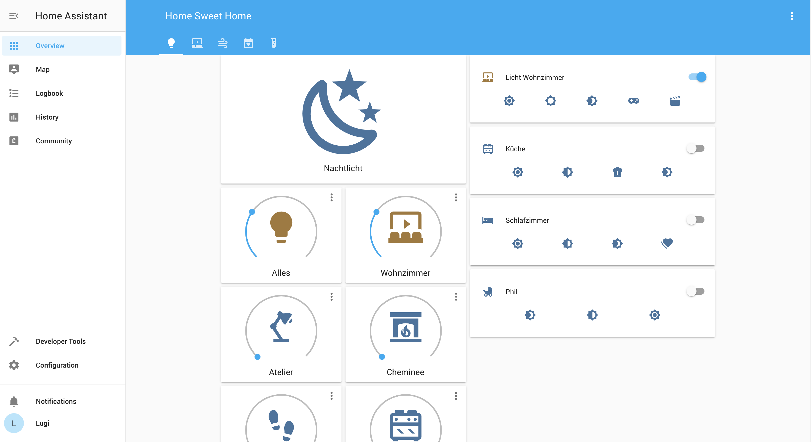
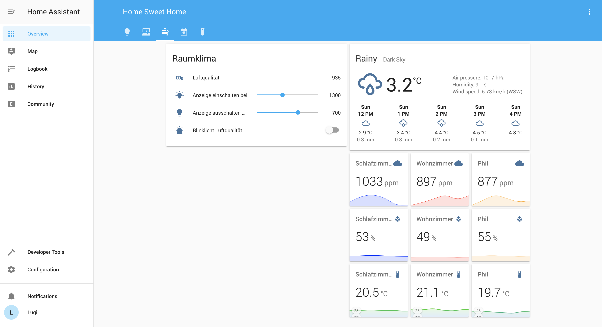

# Homeassistant Config
This repo contains my private home assistant config. It contains a few examples, such as:

* Quite a few Philips Hue lights
* Netatmo room climate sensors
* Automations combining light actions with bad air quality
* Media center actions
* ....more to come

This config replaces my previous one: https://github.com/lugipfupf/home-assistant-config

## Lights

## Room climate
