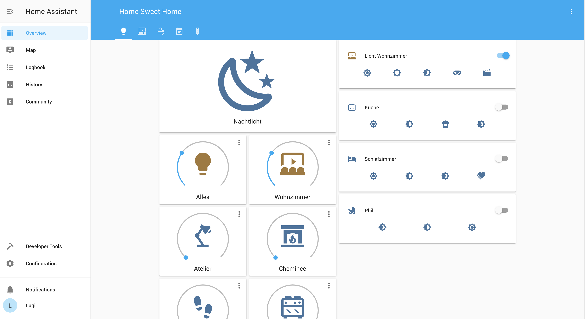
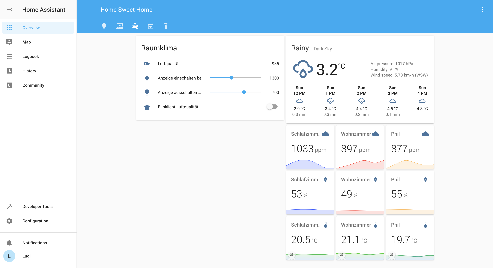

# Homeassistant Config
This repo contains my private home assistant config. It contains a few examples, such as:

* Quite a few Philips Hue lights
* Netatmo room climate sensors
* Automations combining light actions with bad air quality
* Media center actions
* ....more to come

This config replaces my previous one: https://github.com/lugipfupf/home-assistant-config

## Lights

## Room climate

# Docker
After switching to PostgreSQL as the database, I now have also included a docker-compose.yml file. It creates two networks, one internal only to allow Homeassistant to communicate with the db. Refer to this file to find out which folders need to be there before starting the containers.